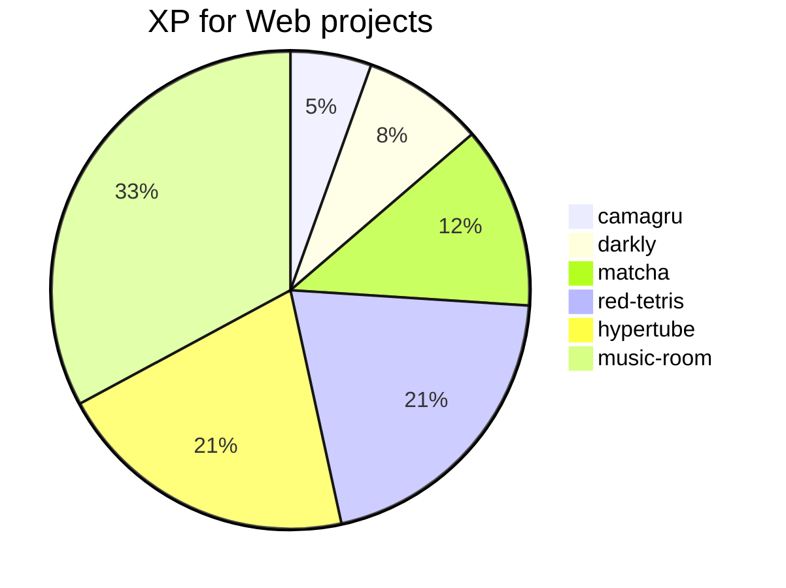
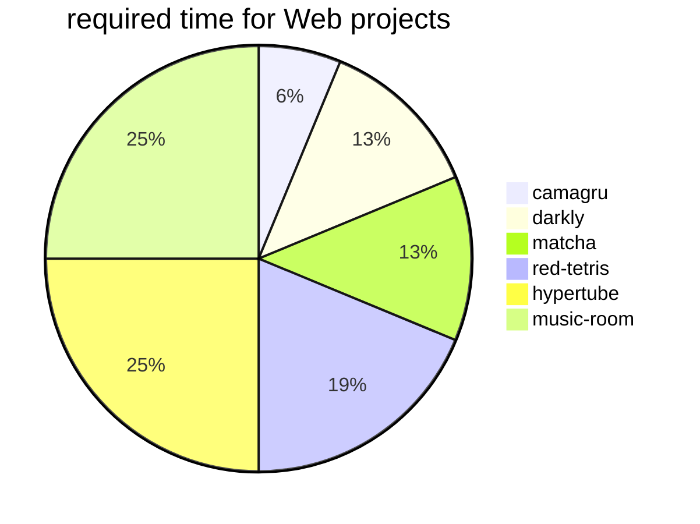
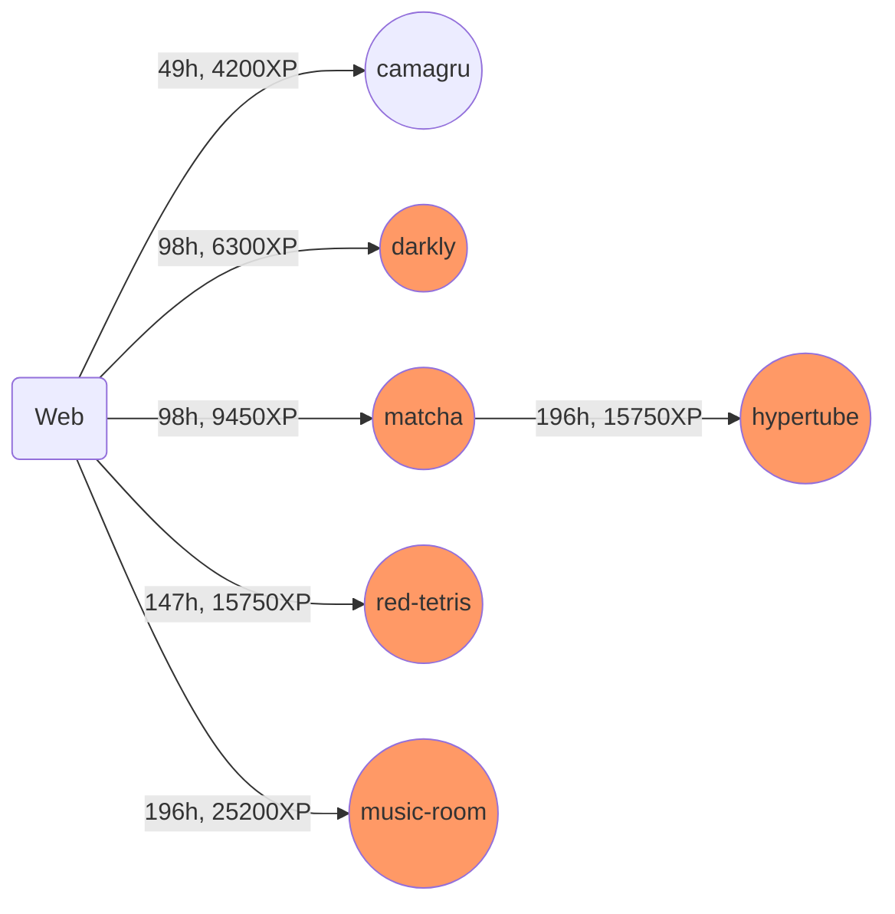
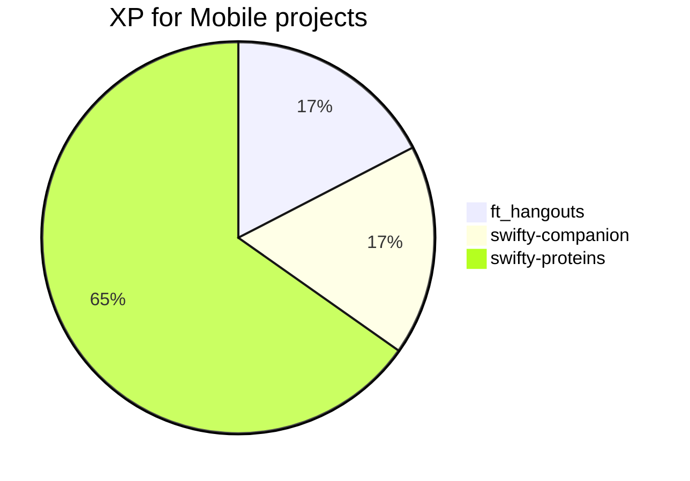
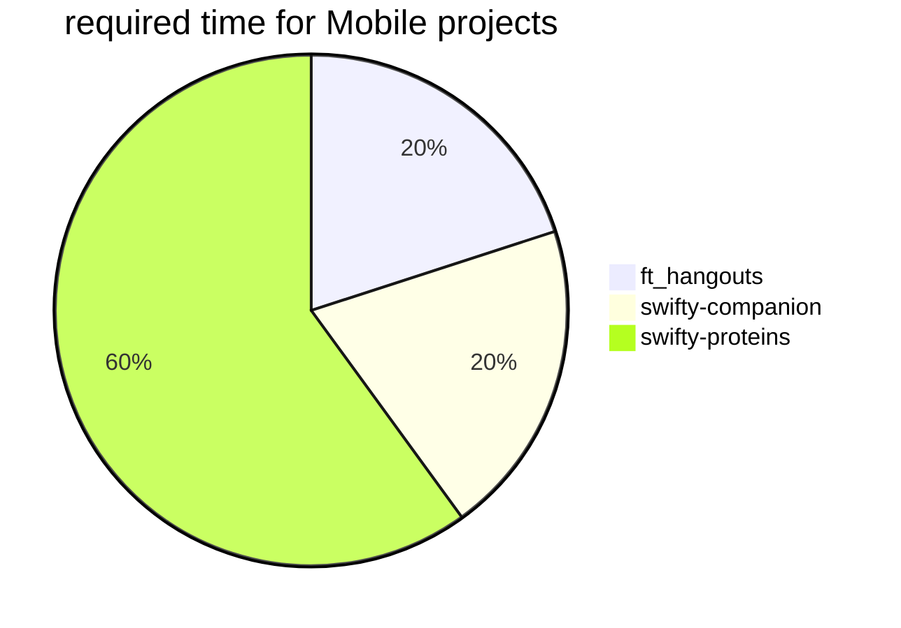
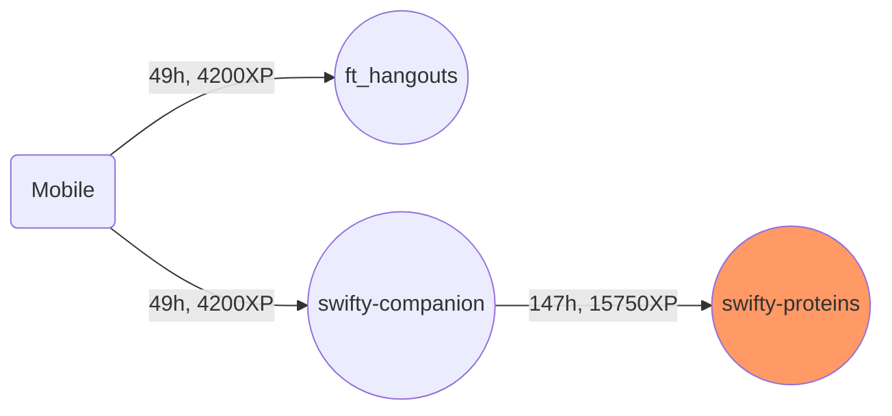

## Web, mobile branch

### Web branch
<table>
<tr><th>Project</th><th>Team</th><th>Time</th><th>XP</th><th>Description</th></tr>
<tr>
	<td>darkly <td>Group 2<td>98h<td>6300
	<td>Introductory project to computer security in the specific domain of the web, this project will make you dissect a vulnerable website. In doing so, you will develop your own way of thinking about security in a web application and become aware of the problems related to simple development errors, both from a programming point of view and from a design point of view.
</tr>
<tr>
	<td>camagru</td>
	<td>Solo</td>
	<td>49h</td>
	<td>4200</td>
	<td>This project is a warmup for web. You will need to realize, a small, instagram-like website allowing its users to create and share photomontage. You will, from scratch, implement basic functionnalities used by any website with a userbase 
	</td>
</tr>
<tr>
	<td>matcha
	<td>Group 2
	<td>98h
	<td>9450
	<td>This second project will introduce a more evolved tool to create your web applications: the micro-framework. We invite you to create, in the language of your choice, a dating site. Interaction between users is the heart of the project! 
</tr>
<tr><td>red-tetris <td>Group 2<td>147h<td>15750<td>The goal of this project is to develop a multiplayer tetris game on the network with a set of software exclusively from Full Stack Javascript.</tr>
<tr><td>music-room <td>Group 2-4<td>196h<td>25200<td>Project in partnership with Deezer. In a group, create a complete mobile app of collaborative playlist using the SDK and API of Deezer. On the menu, mobile native development, back-end development and creation of API REST.</tr>
<tr><td>hypertube <td>Group 2-4<td>196h<td>15750<td>Last project in this series, the Hypertube project invites you to discover an extremely powerful tool category: MVC frameworks. You will learn how to manipulate a MVC, in the language of your choice, to create a streaming site of videos downloaded via the BitTorrent protocol.
</tr>
</table>

### Web branch

---
### Mobile branch
<table>
<tr><th>Project</th><th>Team</th><th>Time</th><th>XP</th><th>Description</th></tr>
<tr><td>ft_hangouts <td>solo<td>49h<td>4200<td>The goal of this project is to get you acquainted with mobile app development. You will create a contact management mobile app. You will have to understand how an mobile app functions, how mobile manages your application and how to use the SDK</tr>
<tr><td>swifty-companion <td>solo<td>49h<td>4200<td>This project is an introduction to mobile programming. The goal is to create, an application which will allow you to get infos about 42students, using the API.</tr>
<tr><td>swifty-proteins <td>Group 2<td>147h<td>15750<td>This project will give you the opportunity to create 3D scenes. For the most part, you will make an application that models ligands in 3D. This will also help you to deepen your knowledge of a mobile framework.</tr>
</table>

### Mobile branch

